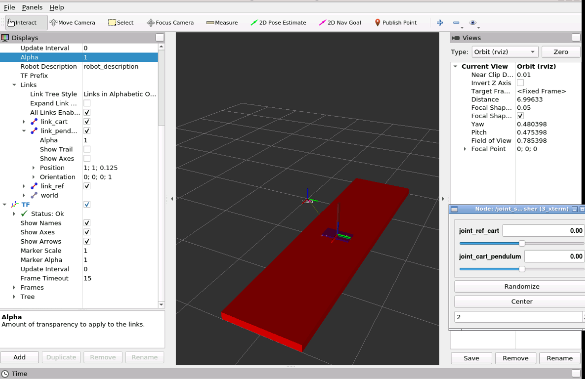
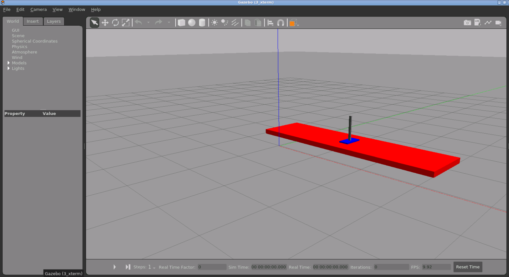

# inverted-pendulum-control
## Overview:
This project focuses on controlling an inverted pendulum, a system comprising a cart that performs linear motion, and a pendulum capable of rotation. This system is often used for testing controllers due to its non-linear and inherently unstable nature. The primary objective is to maintain the pendulum in an upright position while keeping the cart at a desired location.


A common approach in the industry is to use a PID controller, known for its simplicity and effectiveness. In this implementation, two PID controllers are employed: one to maintain the pendulum's upright position and the other to drive the cart to the desired position. These controllers' actions are then combined. However, tuning such a controller can be challenging. Therefore, in this project, Genetic Algorithm (GA) optimization is utilized to learn the controller gains. Initially, random gains are set, and the simulation runs repeatedly, adjusting the gains based on the gathered experience. Given that the simulation represents a black-box function, GA optimization is an appropriate method for this task.

## PID:
A PID controller, which stands for Proportional-Integral-Derivative controller, is a control loop feedback mechanism widely used in industrial control systems. It continuously calculates an action value based on the error, the difference between a desired setpoint and a measured process variable. 

The PID controller output ) can be expressed as:

=K_pe(t)+K_i\int_{0}^{t}e(\tau)d\tau+K_d\frac{d}{dt}e(t))

Where:
Where:
-  is the proportional gain
-  is the integral gain
-  is the derivative gain
- ) is the error value at time 

An intuitive explanation is provided by Brian Douglas in this [video](https://youtu.be/UR0hOmjaHp0?si=htCSecChTK2qcQvb).

## Genetic Algorithm:
A Genetic Algorithm (GA) is an evolutionary heuristic optimization technique that mimics the process of natural selection. In each iteration, the GA maintains a population of potential solutions, where each solution, represented as a set of six PID gains in this case, is known as an individual. The population evolves over generations through two primary processes: mating and mutation. During mating, two individuals are combined to produce two new offspring, transforming the original individuals without changing the population size (in some implementations, mating increases the population size). Mutation applies random changes to individuals to enable exploration (controlled randomness **might** result in discovering a better solution). In our example, this is done by adding random values drawn from a normal distribution with a mean of 1 and a standard deviation of 1 to a subset of the solution's parameters (the PID gains). Both mating and mutation occur with user-defined probabilities. Ultimately, the principle of survival of the fittest is applied to select the optimal solution, ensuring that the best-performing individuals are retained and propagated through subsequent generations.

Mathworks provides a brief and good [explanation](https://www.mathworks.com/help/gads/what-is-the-genetic-algorithm.html) on GA.

## Implmentation using ROS + Gazebo:
The implementation involves modeling an inverted pendulum in Gazebo, while a controller and an optimizer run on ROS. Gazebo and ROS communicate seamlessly: ROS sends control actions to Gazebo, which updates the state of the inverted pendulum and sends the updated state back to ROS. This interaction is illustrated in the following figure:


### Nodes Overview

#### 1. `update_pend_pose_data` Node
- **Purpose**: Publishes the pendulum orientation and the cart position, which facilitates the exchange of relevant inverted pendulum data between Gazebo and ROS.
- **Functionality**:
  - Collects relevant pendulum pose data by listening to the `/gazebo/link_states` topic and calling the `/gazebo/get_link_state` service.
  - Publishes the data using a custom message of type `ControlPoseData` to the `/inverted_pendulum/control_pose_data` topic.
- **Launch file**: `inverted_pendulum_pkg/launch/update_pend_pose.launch`.

#### 2. `controller_node` Node
- **Purpose**: Computes the control action based on the current state of the inverted pendulum.
- **Functionality**:
  - Provides a service `/inverted_pendulum/set_pid_gains` for changing PID gains. The service uses a custom service of type `UpdatePIDParams` that stores a set of controller gains.
  - Computes the control action. The node subscribes to the `/inverted_pendulum/control_pose_data`topic to obtain the inverted pendulum state.
  - Sends the control action to Gazebo by publishing to `/inverted_pendulum/joint_cart_controller/command` provided by `gazebo_ros_control` plugin.  
- **Launch file**: `inverted_pendulum_pkg/launch/controller.launch`

#### 3. `compute_objective_node` Node
- **Purpose**: Evaluate a set of controller gains.
- **Functionality**:
  - Provides a service `/inverted_pendulum/compute_objective` for evaluating a potential set of controller gains. The service uses a custom service of type `CandidateSolution`. The service returns the pendulum and cart tracking errors.  
  - Contains a client to the `/inverted_pendulum/set_pid_gains`. The client parses the data stored in `CandidateSolution` into a `UpdatePIDParams` and sends it to the service server where the controller gains are updated.
  - Runs a simulation in Gazebo for a specific amount of time (this can be set when launching the node using roslaunch by passing setting the argument `sim_time`). 
  - Returns the tracking error at the end of the simulation, serving as an objective function that assesses the quality of the controller.
- **Launch file**: `inverted_pendulum_pkg/launch/compute_objective_launch.launch`

#### 4. `optimizer_node` Node
- **Purpose**: Implements the "learning from experience" process through Genetic Algorithm (GA) optimization.
- **Functionality**:
  - Contains a client to `/inverted_pendulum/compute_objective` for evaluating the population individuals.   
  - Updates the population for a specific number of generations (the optimization parameters can only be changed by modifying the script `inverted_pendulum_pkg/scripts/optimizer.py`. This is going to be modified in the future. )
- **Launch file**: `inverted_pendulum_pkg/launch/optimizer.launch`


### Directories breakdown
**Note**: This section provides a breakdown of the project subdirectories and files. It might be skipped if the reader is not interested in the specifics of the project.
#### 1. src directory

| file | purpose |
|-----------------|-----------------|
| update_pend_pose.cpp     | source code of  `update_pend_pose_data` node    |
| control_cart_pendulum.cpp    | source code of  `controller_node` node     |
| compute_objective.cpp     |  source code of  `compute_objective_node` node    |

#### 2. scripts

| file | purpose |
|-----------------|-----------------|
| optimizer.py     | source code of  `optimizer_node` node    |

#### 3. launch

| file | purpose |
|-----------------|-----------------|
| rviz.launch    | visualizes the inverted pendulum in Rviz   |
| world.launch    | launches empty world in Gazebo. Other launch files use it     |
| spawn.launch     |  spawns the inverted pendulum model. Other launch files use it     |
| inverted_pendulum_control.launch | launches empty world, spawns the inverted pendulum, and starts the controller_manager (part of gaebo_ros_control)  |
| update_pend_pose.launch | launches the `update_pend_pose_data` node |
| controller.launch |  launches the `controller_node` node |
| compute_objective_launch.launch| launches the `compute_objective_node` node |
| optimizer.launch | launches the  `optimizer_node`` node |

#### 4. msg
| file | purpose |
|-----------------|-----------------|
| ControlPoseData.msg | Definition of the `ControlPoseData` type|

#### 5. srv
| file | purpose |
|-----------------|-----------------|
| CandidateSolution.srv | Definition of the `CandidateSolution` type|
| UpdatePIDParams.srv | Definition of the `UpdatePIDParams` type |

#### 6. urdf
| file | purpose |
|-----------------|-----------------|
| robot.urdf |  Robot description using urdf markup|
| robot.xacro | Robot description using urdf markup. Differs from robot.urdf by exploiting xacro (xml macros) package to for better code organization |
| robot_properties.xacro | Contains definitions of gazebo materials, xacro macros, and other properties. This gets included in robot.xacro using `xacro:include` |

#### 7. config
| file | purpose |
|-----------------|-----------------|
| inverted_pendulum_control.yaml |  Sets gazebo_ros_control interface through setting the joint_state_publisher and joint_cart_controller |
| my_config.rviz | Stores an Rviz configuration data. the purpose is to avoid the need for adding a robot and a tf objects manually whenever Rviz is launched |

**Note**: joint_cart_controller is of type `effort_controllers/JointEffortController`. For more details on this, refer to [ros_control](https://wiki.ros.org/ros_control) and this [tutorial](https://classic.gazebosim.org/tutorials?tut=ros_control). 

#### 8. CMakeLists.txt

 This file defines the build process. It manages dependencies and enables building projects across different platforms. A few parts of the CMakeLists.txt file are highlighted and explained below:
##### bring dependencies into the build
```
find_package(catkin REQUIRED COMPONENTS
  roscpp
  rospy
  xacro
  message_generation
  control_toolbox
)

```
##### generating custom messages and services
```
add_message_files(
  FILES
  ControlPoseData.msg
)
add_service_files(
  FILES
  UpdatePIDParams.srv
  CandidateSolution.srv
)
generate_messages(
  DEPENDENCIES
  std_msgs
)

```
##### generating executables from cpp source files
```
add_executable(objective_server src/compute_objective.cpp)
add_executable(controller src/control_cart_pendulum.cpp)
add_executable(update_pose_data src/update_pend_pose.cpp)

```
##### specifying libraries used for linking the targets (executables) to their dependencies
```
target_link_libraries(objective_server
  ${catkin_LIBRARIES}
)
target_link_libraries(controller
  ${catkin_LIBRARIES}
)
target_link_libraries(update_pose_data
  ${catkin_LIBRARIES}
)
```
#### 9. package.xml
Provides meta-information about the package. It also provides high-level dependency management. Please refer to the [package.xml](inverted_pendulum_pkg/package.xml) file for more details.
## Using the package 
#### Building the package 
Add the package to the src directory of your workspace. Then, in a shell, execute the following:
```
roscd; cd ..
catkin_makr --only-pkg-with-deps inverted_pendulum_pkg
```
#### Visualizing the inverted pendulum in Rviz

```
roslaunch inverted_pendulum_pkg rviz.launch
```
The following should appear:


**Note**: At first, the model colors will not be set until a _Fixed frame_ link is set by going to the _Global options_ under the _Display_ panel.
This command also launches the `joint_state_publisher_gui`, enabling the user to simulate joint movement.

#### Starting Gazebo, spawning the model
```
roslaunch inverted_pendulum_pkg rviz.launch

```
The following should appear:


This command starts Gazebo, spawns the model, and takes care of applying the control actions to the model. Due to using `gazebo_ros_control` [plugin](https://classic.gazebosim.org/tutorials?tut=ros_gzplugins) and launching the controller manager, the topic `/inverted_pendulum/joint_cart_controller/command` should appear after using `rostopic list`.

**Note**: The simulation is paused by default. 

#### Launching the `update_pend_pose_data` and `controller_node` nodes
```
roslaunch inverted_pendulum_pkg controller.launch
```

To ensure the node is up and running, you should see the `/inverted_pendulum/set_pid_gains` service when executing `rosservice list` in a shell. The controller is constantly computing control actions. At first, however, the inverted pendulum pose data should be available. Thus, to see the controller in action, the `update_pend_pose_data` node has to be running first. To do that, execute the following command
```
roslaunch inverted_pendulum_pkg update_pend_pose.launch
```
Now unpause the simulation by executing `rosservice call /gazebo/unpause`. You should see the pendulum falling. Now, the pendulum pose data can be obtained by executing `rostopic echo /inverted_pendulum/control_pose_data`.
By default, the controller gains are set to zeros. However, this can be changed by calling the `/inverted_pendulum/set_pid_gains` service provided by the `controller_node` as follows
```
rosservice call /inverted_pendulum/set_pid_gains <TAB><TAB>
```
fill in the gains and execute the command. You should see the pendulum starting to move.

#### Launching the `compute_pbjective_node` and `optimizer_node` nodes
```
roslaunch inverted_pendulum_pkg compute_objective_launch.launch sim_time:=3
```
In another shell

```
roslaunch inverted_pendulum_pkg optimizer.launch
```


 
